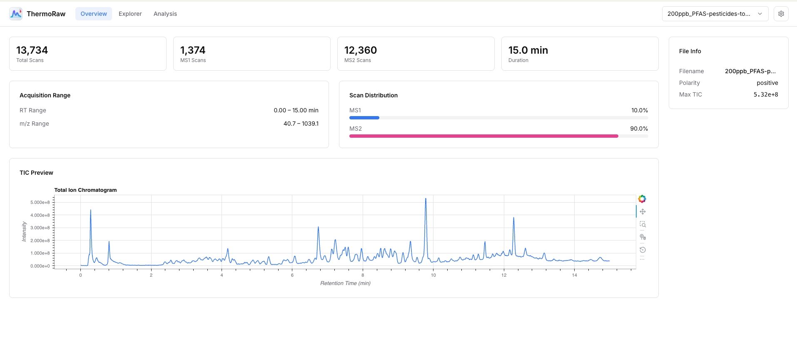
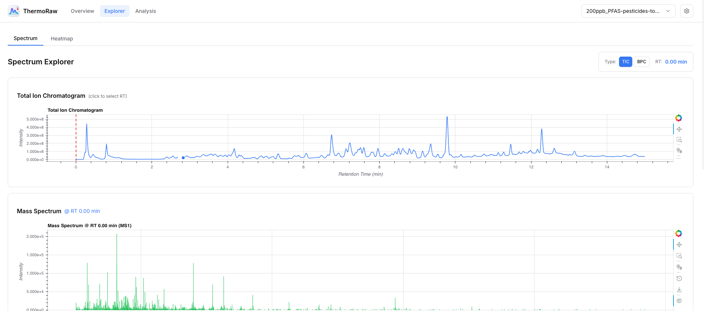
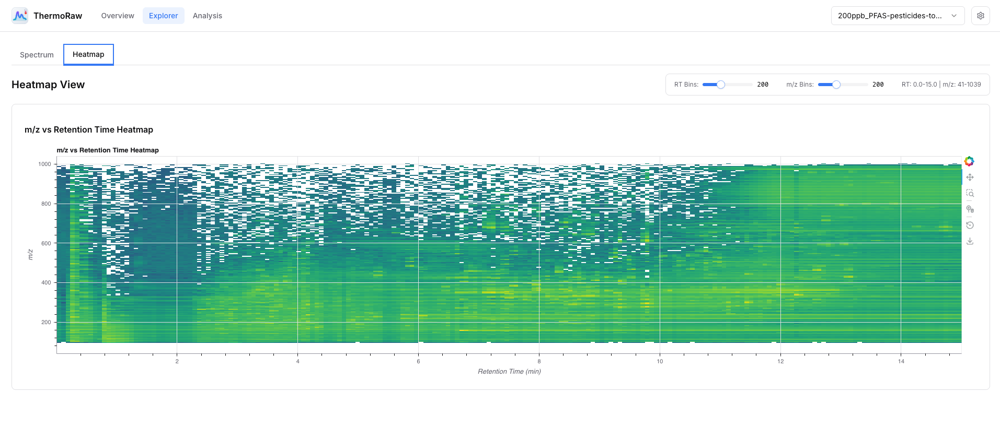
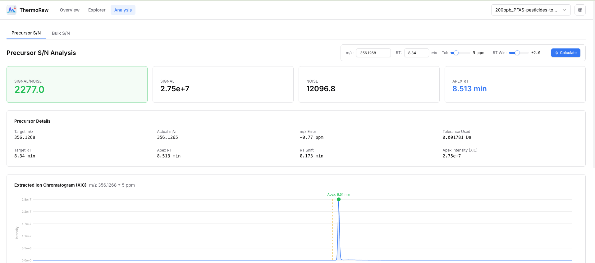
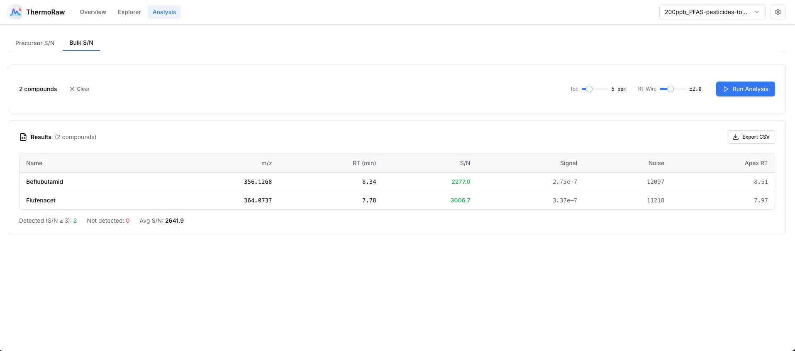

# ThermoRaw

Interactive mass spectrometry data analysis dashboard for Thermo Scientific instruments. Built with FastAPI, React, and Bokeh.



<details>
<summary><b>More Screenshots</b></summary>

| Spectrum Explorer | Heatmap View |
|:-----------------:|:------------:|
|  |  |

| Precursor S/N Analysis | Bulk S/N Analysis |
|:----------------------:|:-----------------:|
|  |  |

</details>

## Quick Start

### Download

| Platform | Architecture | Download |
|----------|--------------|----------|
| **macOS** | Apple Silicon (M1/M2/M3) | [ThermoRaw-macos-arm64.dmg](https://github.com/RusEu/thermo-raw/releases/download/v0.4.9/ThermoRaw-macos-arm64.dmg) |
| **Windows** | x64 | [ThermoRaw-windows-x64-setup.exe](https://github.com/RusEu/thermo-raw/releases/download/v0.4.9/ThermoRaw-windows-x64-setup.exe) |
| **Linux** | x64 | [ThermoRaw-linux-x64.tar.gz](https://github.com/RusEu/thermo-raw/releases/download/v0.4.9/ThermoRaw-linux-x64.tar.gz) |

> See all releases: [Releases](https://github.com/RusEu/thermo-raw/releases)
## Features

### File Management
- **Upload & Convert**: Upload Thermo `.raw` files (automatically converted to mzML) or `.mzML` files directly
- **Drag & Drop**: Simple drag-and-drop file upload interface
- **File Browser**: Quick switching between multiple loaded files

### Overview Dashboard
- **File Statistics**: Total scans, MS1/MS2 scan counts, retention time range, m/z range, polarity
- **TIC Plot**: Total Ion Chromatogram with interactive zoom and pan
- **BPC Plot**: Base Peak Chromatogram visualization
- **Quick Stats**: Maximum and mean TIC values at a glance

### Spectrum Explorer
- **Interactive Chromatogram**: Click anywhere on TIC/BPC to select a retention time
- **RT Slider**: Fine-tune retention time selection with precision slider
- **Mass Spectrum View**: Full mass spectrum at selected retention time with zoom capabilities
- **2D Heatmap**: m/z vs retention time intensity visualization
- **Intensity Range Control**: Adjustable min/max intensity thresholds for heatmap

### Signal-to-Noise Analysis

#### Single Precursor Analysis
- **Precursor SNR**: Calculate Signal-to-Noise Ratio for any m/z at a given retention time
- **PPM Tolerance**: Configurable mass tolerance (default ±5 ppm for Orbitrap)
- **RT Window**: Adjustable retention time search window for peak detection
- **Peak Apex Detection**: Automatic detection of chromatographic peak apex
- **XIC Visualization**: Extracted Ion Chromatogram for the target m/z
- **Apex Spectrum**: Mass spectrum at the detected peak apex

#### Bulk SNR Analysis
- **Batch Processing**: Analyze multiple compounds in a single operation
- **CSV Import**: Upload compound lists (name, m/z, RT) from CSV files
- **Paste Support**: Directly paste tab or comma-separated compound data
- **Results Table**: Sortable results with SNR, signal, noise, apex RT, and actual m/z
- **CSV Export**: Download results as CSV for further analysis
- **Top Peaks**: View highest intensity peaks with their SNR values

### Technical Features
- **Thermo Noise Data**: Uses actual instrument noise data when available (mzML converted with `-N` flag)
- **Binary Caching**: Parsed files are cached for instant subsequent access
- **Native Desktop App**: Standalone executable with native window (no browser required)
- **Cross-Platform**: Available for macOS (Apple Silicon), Windows (x64), and Linux (x64)
- **Dark/Light Theme**: Automatic theme detection with manual override

## Development

### Quick Start (Docker)

The easiest way to run locally for development:

```bash
git clone https://github.com/RusEu/thermo-raw.git
cd thermo-charts
docker-compose up
```

- Frontend: http://localhost:5173
- Backend API: http://localhost:8000

Docker handles all dependencies including ThermoRawFileParser for `.raw` file conversion.

### Project Structure

```
thermo-charts/
├── apps/
│   ├── backend/          # FastAPI + Bokeh backend
│   │   ├── src/thermo_raw/
│   │   │   ├── main.py           # FastAPI app entry point
│   │   │   ├── api/              # API routes
│   │   │   └── services/         # Data processing services
│   │   └── pyproject.toml
│   └── frontend/         # React + Vite frontend
│       ├── src/
│       └── package.json
├── scripts/              # Build scripts
└── docker-compose.yml    # Docker development setup
```

### Manual Setup (Without Docker)

Requires:
- Python 3.12+
- Node.js 20+
- [uv](https://docs.astral.sh/uv/) (Python package manager)
- [Mono](https://www.mono-project.com/) (for `.raw` file conversion on macOS/Linux)

```bash
# Clone the repository
git clone https://github.com/RusEu/thermo-raw.git
cd thermo-charts

# Backend
cd apps/backend
uv sync
uv run python -m thermo_raw.main

# Frontend (in another terminal)
cd apps/frontend
npm install
npm run dev
```

### Building Standalone Executable

```bash
# macOS/Linux
./scripts/build-standalone.sh

# Windows
scripts\build-standalone.bat
```

The executable will be in `apps/backend/dist/`.

### ThermoRawFileParser

For `.raw` file conversion, download ThermoRawFileParser from [compomics/ThermoRawFileParser](https://github.com/compomics/ThermoRawFileParser/releases) and place it in:
- `apps/backend/vendor/macos/ThermoRawFileParser` (macOS)
- `apps/backend/vendor/windows/ThermoRawFileParser.exe` (Windows)
- `apps/backend/vendor/linux/ThermoRawFileParser` (Linux)

Or set the `THERMO_RAW_FILE_PARSER` environment variable to the executable path.

## License

MIT
